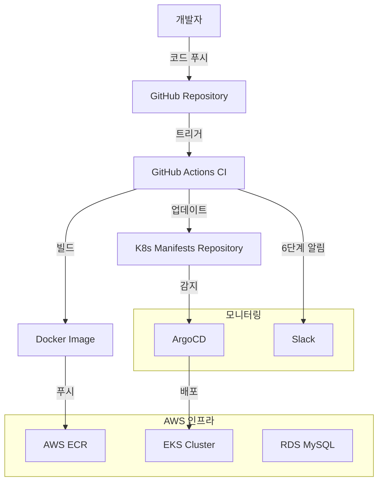

# PortForge CI/CD & GitOps 완전 가이드

## 📋 목차
1. [개요](#개요)
2. [전체 아키텍처](#전체-아키텍처)
3. [GitOps와 ArgoCD 이해하기](#gitops와-argocd-이해하기)
4. [사전 준비사항](#사전-준비사항)
5. [ArgoCD 설치 및 설정](#argocd-설치-및-설정)
6. [CI/CD 파이프라인 구성](#cicd-파이프라인-구성)
7. [Slack 알림 시스템](#slack-알림-시스템)
8. [서비스별 설정 가이드](#서비스별-설정-가이드)
9. [배포 과정 및 모니터링](#배포-과정-및-모니터링)
10. [문제 해결 가이드](#문제-해결-가이드)
11. [팀원별 역할 가이드](#팀원별-역할-가이드)
12. [자주 묻는 질문 (FAQ)](#자주-묻는-질문-faq)
13. [매니페스트 파일 구조](#매니페스트-파일-구조)

---

## 개요

PortForge 프로젝트는 **GitOps 방식의 완전 자동화된 CI/CD 파이프라인**을 구축하여 5개의 MSA 서비스를 관리합니다.

### 🎯 주요 특징
- **완전 자동화**: 코드 푸시 → 빌드 → 배포까지 자동 진행 (약 3-5분)
- **GitOps**: Git을 통한 배포 상태 관리 및 추적
- **실시간 모니터링**: Slack을 통한 6단계 실시간 알림
- **롤백 지원**: ArgoCD를 통한 쉬운 롤백 및 버전 관리
- **보안**: AWS ECR을 통한 안전한 이미지 관리

### �️ 관리 대상 서비스
- ✅ **Project Service**: 프로젝트 관리 서비스 (완료)
- ✅ **Team Service**: 팀 관리 서비스 (완료)
- ✅ **Support Communication Service**: 고객 지원 서비스 (완료)
- 🔄 **AI Service**: AI 기능 서비스 (설정 예정)
- 🔄 **Auth Service**: 인증/인가 서비스 (별도 관리)

### 🎯 최종 목표
- ✅ GitHub 저장소 변경 시 자동 배포
- ✅ `https://argocd.portforge.org` 도메인으로 팀원 접근
- ✅ 5개 MSA 서비스 통합 관리
- ✅ default 네임스페이스에 모든 리소스 배포

---

## 전체 아키텍처



### 🔧 기술 스택
- **CI**: GitHub Actions (빌드, 테스트, 이미지 푸시)
- **CD**: ArgoCD (GitOps 기반 배포)
- **Container Registry**: AWS ECR (Docker 이미지 저장)
- **Orchestration**: AWS EKS (Kubernetes 클러스터)
- **Database**: AWS RDS MySQL (데이터 저장)
- **Monitoring**: Slack Webhooks (실시간 알림)
- **Infrastructure**: Terraform (인프라 코드 관리)

---

## GitOps와 ArgoCD 이해하기

### 🤔 GitOps란?

**GitOps**는 Git 저장소를 "단일 진실 공급원(Single Source of Truth)"으로 사용하여 인프라와 애플리케이션을 관리하는 방법론입니다.

#### 전통적인 배포 방식 vs GitOps
```
🔴 전통적인 방식 (Push 기반)
개발자 → kubectl apply → Kubernetes 클러스터
       ↑ 직접 명령어 실행

🟢 GitOps 방식 (Pull 기반)  
개발자 → Git Push → GitHub → ArgoCD → Kubernetes 클러스터
                           ↑ 자동 감지 & 배포
```

#### GitOps의 핵심 원칙
1. **선언적(Declarative)**: 원하는 상태를 YAML로 선언
2. **버전 관리(Versioned)**: 모든 변경사항이 Git에 기록
3. **자동화(Automated)**: 수동 개입 없이 자동 배포
4. **관찰 가능(Observable)**: 실시간 상태 모니터링

### 🚀 ArgoCD란?

**ArgoCD**는 Kubernetes를 위한 GitOps 도구로, Git 저장소의 변경사항을 자동으로 감지하여 Kubernetes 클러스터에 배포합니다.

#### ArgoCD의 주요 기능
- **🔄 자동 동기화**: Git 변경사항 자동 감지 및 배포
- **🎯 선언적 관리**: YAML 파일로 애플리케이션 상태 정의
- **👀 시각적 모니터링**: 웹 UI로 실시간 상태 확인
- **🔙 롤백 지원**: 이전 버전으로 쉬운 롤백
- **🔐 보안**: RBAC 기반 접근 제어

### 🏗️ Portforge CI/CD 파이프라인 구조

```
📝 코드 작성 & 커밋
    ↓
🔨 CI (GitHub Actions)
    ├── 코드 빌드
    ├── 테스트 실행  
    ├── Docker 이미지 생성
    └── ECR에 이미지 푸시
    ↓
📝 매니페스트 업데이트 (수동 또는 자동)
    ├── deployment.yaml 이미지 태그 변경
    └── Git에 푸시
    ↓
🚀 CD (ArgoCD)
    ├── Git 저장소 모니터링 (3분 간격)
    ├── 변경사항 자동 감지
    ├── Kubernetes에 자동 배포
    └── 상태 모니터링 & 알림
```

### 🎭 App of Apps 패턴이란?

**App of Apps**는 ArgoCD에서 여러 애플리케이션을 효율적으로 관리하기 위한 패턴입니다.

#### 구조 예시
```
🏢 portforge-app-of-apps (메인 Application)
├── 📱 portforge-project-service
├── 🔐 portforge-auth-service  
├── 🤖 portforge-ai-service
├── 🎧 portforge-support-service
└── 👥 portforge-team-service
```

#### 장점
- **중앙 집중 관리**: 하나의 Application으로 전체 시스템 관리
- **일관성**: 모든 서비스에 동일한 정책 적용
- **확장성**: 새 서비스 추가 시 applications/ 디렉토리에 파일만 추가
- **의존성 관리**: 서비스 간 배포 순서 제어 가능

### 🔄 실제 워크플로우 예시

#### 시나리오: Project Service 업데이트

1. **개발자 작업**
   ```bash
   # 코드 수정 후 커밋
   git add .
   git commit -m "Add new project feature"
   git push origin main
   ```

2. **GitHub Actions (CI)**
   ```yaml
   # 자동 실행됨
   - 코드 빌드 ✅
   - 테스트 실행 ✅  
   - Docker 이미지 생성 ✅
   - ECR 푸시 ✅ (예: project-service:v1.2.3)
   ```

3. **매니페스트 업데이트**
   ```bash
   # Project/deployment.yaml 수정
   image: 123456789.dkr.ecr.ap-northeast-2.amazonaws.com/project-service:v1.2.3
   
   git add Project/deployment.yaml
   git commit -m "Update project-service to v1.2.3"
   git push origin main
   ```

4. **ArgoCD (CD)**
   ```
   ⏰ 3분 후 자동 감지
   📥 Git에서 변경사항 Pull
   🔄 Kubernetes에 새 이미지 배포
   ✅ 배포 완료 & 상태 확인
   ```

5. **결과 확인**
   - ArgoCD UI에서 실시간 배포 상태 확인
   - 새로운 Pod가 생성되고 이전 Pod 종료
   - 서비스 정상 동작 확인

### 💡 GitOps의 이점

#### 🔒 보안
- **No kubectl 접근**: 개발자가 직접 클러스터 접근 불필요
- **감사 추적**: 모든 변경사항이 Git에 기록
- **권한 관리**: Git 권한으로 배포 권한 제어

#### 🚀 효율성  
- **자동화**: 수동 배포 작업 제거
- **일관성**: 환경별 배포 방식 통일
- **속도**: 빠른 배포 및 롤백

#### 👥 협업
- **투명성**: 모든 팀원이 배포 상태 확인 가능
- **코드 리뷰**: 인프라 변경사항도 코드 리뷰 프로세스 적용
- **지식 공유**: Git 히스토리로 변경 이유 추적 가능

---

## 사전 준비사항

### 🔑 필수 계정 및 권한
1. **GitHub 계정**: 각 서비스 Repository 접근 권한
2. **AWS 계정**: ECR, EKS 접근 권한
3. **Slack 워크스페이스**: Webhook 생성 권한 또는 관리자 협조

### 📂 Repository 구조
```
PortForge-Dev/
├── Project_Service/           # 프로젝트 서비스
│   └── .github/workflows/
│       └── ci.yaml           # CI/CD 파이프라인 (완료)
├── Team-BE/                  # 팀 서비스
│   └── .github/workflows/
│       └── ci.yaml           # CI/CD 파이프라인 (완료)
├── Support_Communication_Service/  # 지원 서비스
│   └── .github/workflows/
│       └── ci.yaml           # CI/CD 파이프라인 (완료)
├── Ai/                       # AI 서비스
│   └── .github/workflows/
│       └── ci.yaml           # CI/CD 파이프라인 (설정 예정)
├── Auth/                     # 인증 서비스
│   └── .github/workflows/
│       └── ci.yaml           # CI/CD 파이프라인 (별도 관리)
└── k8s/                      # Kubernetes 매니페스트
    ├── Project/              # 프로젝트 서비스 K8s 파일
    ├── Team/                 # 팀 서비스 K8s 파일
    ├── Support/              # 지원 서비스 K8s 파일
    ├── Ai/                   # AI 서비스 K8s 파일
    └── argocd/               # ArgoCD 설정 파일
        ├── app-of-apps.yaml
        └── applications/     # 각 서비스별 ArgoCD 앱
```

### 1. 필수 환경
- ✅ **EKS 클러스터** 실행 중
- ✅ **kubectl** 설치 및 클러스터 연결 확인
- ✅ **AWS Load Balancer Controller** 설치됨
- ✅ **Route53 호스팅 영역** (`portforge.org`) 설정됨
- ✅ **GitHub 저장소** (`https://github.com/Portforge-Dev/k8s.git`) 접근 권한

### 2. 환경 확인 명령어
```bash
# kubectl 연결 확인
kubectl get nodes

# AWS Load Balancer Controller 확인
kubectl get pods -n kube-system

# 기존 서비스 확인
kubectl get pods -n default
kubectl get svc -n default
```

---

## ArgoCD 설치 및 설정

### 1. ArgoCD 공식 매니페스트 설치 (default 네임스페이스에)
```bash
# ArgoCD를 default 네임스페이스에 직접 설치
kubectl apply -f https://raw.githubusercontent.com/argoproj/argo-cd/stable/manifests/install.yaml

# 설치 완료 대기 (약 2-3분)
kubectl wait --for=condition=available --timeout=300s deployment/argocd-server

# 설치 확인
kubectl get pods
```

**중요**: 별도의 `argocd` 네임스페이스를 생성하지 않고 `default` 네임스페이스에 직접 설치합니다. 이렇게 하면 모든 MSA 서비스들과 ArgoCD가 같은 네임스페이스에서 관리됩니다.

### 2. ArgoCD 초기 비밀번호 확인
```bash
# admin 계정의 초기 비밀번호 (base64 인코딩된 상태로) 확인
kubectl get secret argocd-initial-admin-secret -o jsonpath="{.data.password}"

# 결과 예시: YWRtaW4tcGFzc3dvcmQtMTIzNDU2Nzg=
```

**비밀번호 디코딩 방법:**
1. 위 명령어 실행 결과를 복사
2. **https://www.base64decode.org/** 사이트 접속
3. 복사한 값을 붙여넣기 후 "DECODE" 클릭
4. 디코딩된 비밀번호를 메모장에 저장

**또는 다른 base64 디코딩 사이트 사용:**
- https://base64.guru/converter/decode/text
- https://www.base64decode.net/

---

## ArgoCD 도메인 접근 설정

### 1. ArgoCD 서버 설정 적용
```bash
# ArgoCD 서버 설정 파일 적용
kubectl apply -f argocd/argocd-server-config.yaml
```

### 2. ArgoCD Ingress 적용
```bash
# ArgoCD Ingress 적용
kubectl apply -f argocd/argocd-ingress.yaml

# Ingress 상태 확인
kubectl get ingress argocd-server-ingress
```

### 3. Route53 DNS 레코드 생성

**AWS 콘솔 → Route53 → 호스팅 영역 → portforge.org**

1. **"레코드 생성"** 클릭
2. **레코드 설정**:
   - **레코드 이름**: `argocd`
   - **레코드 유형**: `A - IPv4 주소 및 일부 AWS 리소스 트래픽 라우팅`
   - **별칭**: `켜기`
   - **라우팅 대상**: `Application/Classic Load Balancer에 대한 별칭`
   - **리전**: `아시아 태평양(서울) ap-northeast-2`
   - **로드 밸런서**: `k8s-portforgeapi-xxx` (목록에서 선택)
3. **"레코드 생성"** 클릭

### 4. ArgoCD 서버 재시작 (새 설정 적용)
```bash
kubectl rollout restart deployment/argocd-server
```

### 5. 접속 확인
```bash
# Ingress ADDRESS 할당 확인 (2-3분 소요)
kubectl get ingress argocd-server-ingress

# 브라우저에서 접속 테스트
# https://argocd.portforge.org
```

---

## GitOps 설정 (App of Apps)

### 1. GitHub 저장소 연결

**ArgoCD 웹 UI (`https://argocd.portforge.org`)에서:**

1. **admin / 초기비밀번호**로 로그인
2. **Settings → Repositories** 메뉴 이동
3. **"CONNECT REPO"** 클릭
4. **저장소 정보 입력**:
   - **연결 방법**: `VIA HTTPS` 선택
   - **Repository URL**: `https://github.com/Portforge-Dev/k8s.git`
   - **Username**: GitHub 사용자명
   - **Password**: GitHub Personal Access Token
5. **"CONNECT"** 클릭하여 연결 테스트

### 2. App of Apps 배포
```bash
# App of Apps Application 생성
kubectl apply -f argocd/app-of-apps.yaml

# Application 생성 확인
kubectl get applications
```

### 3. ArgoCD UI에서 동기화

**ArgoCD 웹 UI에서:**

1. **Applications** 메뉴로 이동
2. **portforge-app-of-apps** 클릭
3. **SYNC** 버튼 클릭
4. **동기화 옵션 설정**:
   - ✅ **PRUNE LAST** 체크
   - ✅ **AUTO-CREATE NAMESPACE** 체크  (default 사용)
      -> 이미 구성되어 있는 default 네임스페이스를 사용하여 리소스 배포
         ( 만약 이로 인해 새로운 네임스페이스가 생성이 된다면 문제가 될 수 있음 )
   - **SYNCHRONIZE RESOURCES**: `all` 선택
5. **"SYNCHRONIZE"** 클릭

### 4. 배포 완료 확인
```bash
# 모든 Application 확인
kubectl get applications

# 모든 서비스 Pod 확인
kubectl get pods

# 모든 서비스 Ingress 확인
kubectl get ingress
```

**예상 결과:**
- 5개 Application 생성: `portforge-project-service`, `portforge-auth-service`, `portforge-ai-service`, `portforge-support-service`, `portforge-team-service`
- 각 서비스별 Pod, Service, Ingress 자동 생성
- 모든 리소스가 `default` 네임스페이스에 배포

---

## 사용법

### 1. ArgoCD 웹 UI 접속 (팀원 공유)
- **URL**: `https://argocd.portforge.org`
- **공유 계정**: `admin`
- **비밀번호**: 초기 설치 시 확인한 비밀번호 (팀원들과 공유)

**팀원 접속 방법:**
1. 팀 리더가 초기 비밀번호를 확인하여 팀원들에게 공유
2. 모든 팀원이 같은 `admin` 계정으로 접속
3. 필요시 ArgoCD UI에서 비밀번호 변경 후 새 비밀번호 재공유

### 2. GitOps 워크플로우

#### 개발자 워크플로우:
```bash
# 1. 매니페스트 파일 수정 (예: deployment.yaml)
vim Project/deployment.yaml

# 2. Git에 변경사항 커밋 & 푸시
git add .
git commit -m "Update project service configuration"
git push origin main

# 3. ArgoCD가 자동으로 감지하여 배포 (약 3분 이내)
```

#### ArgoCD에서 확인:
1. **Applications** 메뉴에서 해당 서비스 클릭
2. **실시간 배포 상태** 모니터링
3. **Sync Status**: `Synced`, **Health Status**: `Healthy` 확인

### 3. 수동 동기화 (필요시)
```bash
# CLI로 수동 동기화
kubectl patch application portforge-project-service -p '{"operation":{"sync":{}}}' --type merge

# 또는 ArgoCD UI에서 SYNC 버튼 클릭
```

### 4. 롤백
```bash
# 이전 버전으로 롤백
kubectl patch application portforge-project-service -p '{"spec":{"source":{"targetRevision":"HEAD~1"}}}' --type merge
```

---

## 트러블슈팅

### 1. ArgoCD 접속 불가
```bash
# ArgoCD 서버 상태 확인
kubectl get pods
kubectl logs deployment/argocd-server

# Ingress 상태 확인
kubectl describe ingress argocd-server-ingress

# DNS 확인 (Windows)
nslookup argocd.portforge.org

# DNS 확인 (PowerShell 대안)
Resolve-DnsName argocd.portforge.org
```

### 2. Application 동기화 실패
```bash
# Application 상태 확인
kubectl describe application portforge-project-service

# ArgoCD Application Controller 로그 확인
kubectl logs deployment/argocd-application-controller
```

### 3. GitHub 저장소 연결 실패
- GitHub Personal Access Token 권한 확인
- 저장소 URL 정확성 확인
- 네트워크 연결 상태 확인

### 4. Ingress ADDRESS 할당 안됨
```bash
# AWS Load Balancer Controller 상태 확인
kubectl get pods -n kube-system

# Ingress 이벤트 확인
kubectl describe ingress argocd-server-ingress

# 일반적으로 2-5분 대기 후 자동 할당됨
```

### 5. 서비스 Pod 시작 실패
```bash
# Pod 상태 확인
kubectl get pods
kubectl describe pod <pod-name>
kubectl logs <pod-name>

# ConfigMap/Secret 확인
kubectl get configmap
kubectl get secret
```

---

## 매니페스트 파일 구조

```
k8s/argocd/
├── README.md                       # 이 가이드 문서
├── app-of-apps.yaml                # 메인 Application (모든 서비스 관리)
├── argocd-ingress.yaml             # ArgoCD UI 도메인 접근용 Ingress
├── argocd-server-config.yaml       # ArgoCD 서버 설정
└── applications/                   # 각 MSA 서비스별 Application
    ├── portforge-project-app.yaml  # Project Service 관리
    ├── portforge-auth-app.yaml     # Auth Service 관리
    ├── portforge-ai-app.yaml       # AI Service 관리
    ├── portforge-support-app.yaml  # Support Service 관리
    └── portforge-team-app.yaml     # Team Service 관리
```

### 각 파일의 역할

#### `app-of-apps.yaml`
- **App of Apps 패턴**의 메인 Application
- `applications/` 디렉토리의 모든 Application을 자동 생성/관리
- 중앙 집중식 서비스 관리

#### `argocd-ingress.yaml`
- ArgoCD 웹 UI 외부 접근을 위한 Ingress
- `argocd.portforge.org` 도메인 라우팅
- ALB 통합 (`portforge-api` 그룹)

#### `argocd-server-config.yaml`
- ArgoCD 서버 설정
- 도메인 기반 접근 허용
- OIDC 설정 (선택사항)

#### `applications/*.yaml`
- 각 MSA 서비스별 ArgoCD Application 정의
- Git 저장소의 해당 디렉토리와 연결
- 자동 동기화 및 복구 설정

### 공통 설정

모든 Application에 적용된 설정:
- **Git 저장소**: `https://github.com/Portforge-Dev/k8s.git`
- **대상 클러스터**: `https://kubernetes.default.svc`
- **네임스페이스**: `default`
- **자동 동기화**: `automated.prune: true`, `automated.selfHeal: true`
- **히스토리 제한**: `revisionHistoryLimit: 10`

---

## 🎉 완료!

이제 완전한 GitOps 파이프라인이 구축되었습니다:

1. **개발자**가 GitHub에 변경사항 푸시
2. **ArgoCD**가 자동으로 감지하여 Kubernetes에 배포
3. **팀원들**이 `https://argocd.portforge.org`에서 실시간 모니터링

### 다음 단계 (선택사항)
- [ ] Slack/Discord 알림 연동
- [ ] ArgoCD Image Updater 설정 (자동 이미지 업데이트)
- [ ] RBAC 권한 세분화 (필요시)
- [ ] 모니터링 대시보드 연동 (Grafana/Prometheus)

**문의사항이나 문제가 발생하면 이 README.md를 참고하여 트러블슈팅하세요!** 🚀

---

## CI/CD 파이프라인 구성

### 🔄 전체 워크플로우

#### 1단계: CI (Continuous Integration)
```yaml
# 트리거 조건
on:
  push:
    branches: [ main, develop ]  # main/develop 브랜치 푸시 시
  pull_request:
    branches: [ main ]           # main으로의 PR 생성 시
```

**진행 과정:**
1. **🚀 Slack 알림**: CI 시작 (누가, 언제, 어떤 커밋으로)
2. **코드 체크아웃**: 최신 코드 가져오기
3. **AWS 인증**: ECR 접근을 위한 자격증명 설정
4. **Docker 빌드**: 애플리케이션 이미지 생성
5. **ECR 푸시**: 이미지를 AWS ECR에 업로드 (Git SHA 태그 + latest)
6. **✅ Slack 알림**: 빌드 성공 또는 ❌ 빌드 실패

#### 2단계: CD (Continuous Deployment)
1. **🔄 Slack 알림**: 배포 시작
2. **K8s 매니페스트 업데이트**: deployment.yaml의 이미지 태그 변경
3. **Git 푸시**: k8s 저장소에 변경사항 커밋
4. **📝 Slack 알림**: 매니페스트 업데이트 완료
5. **ArgoCD 자동 감지**: Git 변경사항 감지 (1-3분 소요)
6. **🔄 Slack 알림**: ArgoCD 동기화 안내

### 📊 이미지 태깅 전략
- **Git SHA 태그**: `abc123def456` (추적성 및 롤백 용이)
- **Latest 태그**: `latest` (개발 편의성)
- **예시**: `023490709500.dkr.ecr.ap-northeast-2.amazonaws.com/project-service:abc123def456`

---

## Slack 알림 시스템

### 🔔 통합 알림 시스템

PortForge는 **2가지 알림 시스템**을 통해 전체 배포 프로세스를 실시간으로 모니터링합니다:

1. **GitHub Actions CI/CD 알림** (6단계)
   - CI 빌드 및 배포 프로세스 알림
   - ECR 이미지 푸시 상태
   - 매니페스트 업데이트 완료

2. **ArgoCD Notifications** (5단계) ⭐ NEW!
   - Pod 재생성 완료 알림
   - 동기화 진행 상태
   - 배포 성공/실패 알림

### 📊 GitHub Actions CI/CD 알림 (6단계)

#### 1. 🚀 CI 시작 알림
```
🚀 [Service Name] CI/CD 시작
Repository: Portforge-Dev/Project_Service
Branch: main
Commit: abc123def456
Author: developer-name
```

#### 2. ✅ 빌드 성공 알림
```
✅ [Service Name] 빌드 성공
Image Tag: abc123def456
ECR Repository: project-service
```

#### 3. ❌ 빌드 실패 알림 (실패 시에만)
```
❌ [Service Name] 빌드 실패
Repository: Portforge-Dev/Project_Service
Branch: main
Commit: abc123def456
Workflow URL: [GitHub Actions 상세 링크]
```

#### 4. 🔄 배포 시작 알림
```
🔄 [Service Name] 배포 시작
Image Tag: abc123def456
Target: Kubernetes Cluster
```

#### 5. 📝 매니페스트 업데이트 완료 알림
```
📝 [Service Name] 매니페스트 업데이트 완료
Image Tag: abc123def456
Status: ArgoCD 동기화 대기 중...
ArgoCD URL: https://argocd.portforge.org
```

#### 6. 🔄 ArgoCD 동기화 안내 알림
```
🔄 [Service Name] ArgoCD 동기화 진행 중
다음 단계: ArgoCD에서 동기화 상태를 확인해주세요
확인 방법:
1. ArgoCD 접속
2. portforge-[service]-service 클릭
3. Sync Status 확인
ArgoCD URL: https://argocd.portforge.org
```

### 📱 Slack 설정 방법

#### 1단계: Slack Webhook URL 생성
1. **Slack 워크스페이스 접속**
2. **Apps 검색** → "Incoming Webhooks" 검색
3. **Add to Slack** 클릭
4. **알림받을 채널 선택** (예: #cicd-alerts)
5. **Webhook URL 복사** (예: `https://hooks.slack.com/services/T.../B.../...`)

#### 2단계: GitHub Secrets 설정
각 서비스 Repository에서 다음 설정:

**Settings** → **Secrets and variables** → **Actions** → **New repository secret**

**필수 Secrets:**
```
SLACK_WEBHOOK_URL: https://hooks.slack.com/services/T.../B.../...
AWS_ACCESS_KEY_ID: AKIA...
AWS_SECRET_ACCESS_KEY: ...
AWS_ACCOUNT_ID: 023490709500
GH_PAT: ghp_... (k8s 저장소 접근용)
```

**필수 Variables:**
```
ECR_REPOSITORY: 서비스별 ECR 저장소 이름
- project-service (Project Service)
- team-service (Team Service)  
- support-service (Support Service)
- ai-service (AI Service)

AWS_REGION: ap-northeast-2
```

### 📊 ArgoCD Notifications 설정 (Pod 재생성 알림) ⭐ NEW!

ArgoCD Notifications를 통해 **Pod가 재생성되었을 때** Slack 알림을 받을 수 있습니다.

#### 알림 종류

1. **🎉 Pod 재생성 완료** (`on-deployed`)
   - 새로운 이미지로 Pod가 성공적으로 재생성되었을 때
   - Sync 성공 + Health 정상 상태

2. **🔄 동기화 진행 중** (`on-sync-running`)
   - ArgoCD가 변경사항을 감지하고 동기화를 시작할 때

3. **✅ 동기화 성공** (`on-sync-succeeded`)
   - Git 변경사항이 Kubernetes에 성공적으로 적용되었을 때

4. **❌ 동기화 실패** (`on-sync-failed`)
   - 동기화 중 오류가 발생했을 때

5. **⚠️ 상태 이상** (`on-health-degraded`)
   - Pod가 비정상 상태일 때

#### 빠른 설치 (3분)

```bash
cd k8s/argocd

# Windows
fix-notifications.bat

# Linux/Mac
chmod +x fix-notifications.sh
./fix-notifications.sh
```

**자세한 설정 가이드**: 
- **빠른 시작**: `QUICK-START-NOTIFICATIONS.md` 참고
- **상세 가이드**: `NOTIFICATIONS-SETUP.md` 참고
- **문제 해결**: `TROUBLESHOOTING.md` 참고

#### Pod 재생성 알림 예시

```
🎉 portforge-team-service Pod 재생성 완료!

📦 배포 정보
• Application: portforge-team-service
• Sync Status: Synced
• Health Status: Healthy
• Revision: 5e5ec6bf155a1ff219f9d889f63ab68b5d48079d

🔄 Pod 상태
• 새로운 Pod가 성공적으로 생성되었습니다
• 이전 Pod는 종료되었습니다

🔗 링크
• ArgoCD에서 확인
```

#### 트러블슈팅

**알림이 오지 않을 때:**

1. **Controller 상태 확인**
   ```bash
   kubectl get pods -n default -l app.kubernetes.io/name=argocd-notifications-controller
   ```

2. **로그 확인**
   ```bash
   kubectl logs -f -n default -l app.kubernetes.io/name=argocd-notifications-controller
   ```

3. **Webhook URL 테스트**
   ```bash
   # PowerShell
   $body = @{text="테스트"} | ConvertTo-Json
   Invoke-RestMethod -Uri "YOUR_WEBHOOK_URL" -Method Post -Body $body -ContentType "application/json"
   ```

4. **Application annotations 확인**
   ```bash
   kubectl get application portforge-team-service -n default -o yaml | grep notifications
   ```

**더 자세한 트러블슈팅**: `TROUBLESHOOTING.md` 파일 참고

---

## 서비스별 설정 가이드

### 🎯 Project Service
- **Repository**: `Portforge-Dev/Project_Service`
- **ECR Repository**: `project-service`
- **K8s Path**: `k8s/Project/`
- **ArgoCD App**: `portforge-project-service`
- **Port**: 8000
- **상태**: ✅ 완료

### 👥 Team Service  
- **Repository**: `Portforge-Dev/Team-BE`
- **ECR Repository**: `team-service`
- **K8s Path**: `k8s/Team/`
- **ArgoCD App**: `portforge-team-service`
- **Port**: 8000
- **상태**: ✅ 완료

### 🎧 Support Communication Service
- **Repository**: `Portforge-Dev/Support_Communication_Service`
- **ECR Repository**: `support-service`
- **K8s Path**: `k8s/Support/`
- **ArgoCD App**: `portforge-support-service`
- **Port**: 8000
- **상태**: ✅ 완료

### 🤖 AI Service
- **Repository**: `Portforge-Dev/Ai`
- **ECR Repository**: `ai-service`
- **K8s Path**: `k8s/Ai/`
- **ArgoCD App**: `portforge-ai-service`
- **Port**: 8000
- **상태**: 🔄 설정 예정

### 🔐 Auth Service
- **Repository**: `Portforge-Dev/Auth`
- **ECR Repository**: `auth-service`
- **K8s Path**: `k8s/Auth/`
- **ArgoCD App**: `portforge-auth-service`
- **Port**: 8000
- **상태**: 🔄 별도 관리

---

## 배포 과정 및 모니터링

### 🚀 일반적인 배포 시나리오

#### 개발자 작업
```bash
# 1. 기능 개발 및 테스트
git checkout -b feature/new-feature
# ... 코드 작성 ...

# 2. 커밋 및 푸시
git add .
git commit -m "feat: 새로운 기능 추가"
git push origin feature/new-feature

# 3. PR 생성 및 리뷰
# GitHub에서 PR 생성 → 코드 리뷰 → 승인

# 4. main 브랜치 병합
git checkout main
git pull origin main
git merge feature/new-feature
git push origin main  # 🚀 CI/CD 자동 트리거!
```

#### 자동 CI/CD 진행 (약 3-5분)
```
⏰ 0분    🚀 Slack: CI 시작 알림
⏰ 1분    ⚙️ GitHub Actions: Docker 빌드 시작
⏰ 2분    ✅ Slack: 빌드 성공 알림
⏰ 2분    🔄 Slack: 배포 시작 알림  
⏰ 3분    📝 Slack: 매니페스트 업데이트 완료
⏰ 3분    🔄 Slack: ArgoCD 동기화 안내
⏰ 4-5분  🎯 ArgoCD: 자동 동기화 및 배포 완료
```

### 📊 배포 상태 확인 방법

#### ArgoCD 대시보드에서 확인
1. **ArgoCD 접속**: https://argocd.portforge.org
2. **서비스 선택**: portforge-[service]-service 클릭
3. **상태 확인**:
   - **Sync Status**: `Synced` (동기화 완료)
   - **Health Status**: `Healthy` (정상 동작)
   - **Last Sync**: 최근 동기화 시간

#### Kubernetes 명령어로 확인
```bash
# Pod 상태 확인
kubectl get pods -l app=project-service

# 서비스 상태 확인  
kubectl get svc project-service

# Ingress 상태 확인
kubectl get ingress project-service-ingress

# 로그 확인
kubectl logs -f deployment/project-deployment
```

### 🔄 롤백 방법

#### ArgoCD를 통한 롤백 (추천)
1. **ArgoCD 대시보드 접속**: https://argocd.portforge.org
2. **해당 서비스 선택**: portforge-[service]-service
3. **History 탭 클릭**
4. **이전 버전 선택** → **Rollback** 클릭
5. **확인**: 자동으로 이전 버전으로 롤백

#### 수동 롤백
```bash
# 이전 이미지 태그로 수동 업데이트
kubectl set image deployment/project-deployment \
  project-container=023490709500.dkr.ecr.ap-northeast-2.amazonaws.com/project-service:[previous-tag]
```

---

## 문제 해결 가이드

### 🚨 일반적인 문제들

#### 1. 빌드 실패 (❌ 빌드 실패 알림)
**증상**: Slack에서 빌드 실패 알림 수신

**해결방법**:
1. **Slack 알림의 "상세 보기" 링크 클릭**
2. **GitHub Actions 로그 확인**
3. **오류 메시지 분석**:
   - Docker 빌드 오류 → Dockerfile 확인
   - 의존성 오류 → package.json/requirements.txt 확인
   - 테스트 실패 → 테스트 코드 수정
4. **코드 수정 후 다시 푸시**

#### 2. ECR 푸시 실패
**증상**: "AWS 인증 오류" 또는 "ECR 접근 거부"

**해결방법**:
1. **GitHub Secrets 확인**:
   - `AWS_ACCESS_KEY_ID` 올바른지 확인
   - `AWS_SECRET_ACCESS_KEY` 올바른지 확인
   - `AWS_ACCOUNT_ID` 올바른지 확인
2. **AWS 계정 권한 확인**: ECR 푸시 권한 있는지
3. **ECR 저장소 존재 여부 확인**

#### 3. ArgoCD 동기화 실패
**증상**: ArgoCD에서 Sync 실패 또는 Degraded 상태

**해결방법**:
1. **ArgoCD 대시보드에서 오류 메시지 확인**
2. **K8s 매니페스트 문법 오류 확인**:
   ```bash
   # YAML 문법 검증
   kubectl apply --dry-run=client -f k8s/Project/
   ```
3. **리소스 충돌 확인**: 네임스페이스, 포트 등
4. **수동으로 Sync 재시도**: ArgoCD에서 "Sync" 버튼 클릭

#### 4. Slack 알림이 오지 않음
**증상**: CI/CD는 성공하지만 Slack 알림 없음

**해결방법**:
1. **SLACK_WEBHOOK_URL Secret 확인**:
   - URL이 올바른지 확인
   - 만료되지 않았는지 확인
2. **Webhook URL 테스트**:
   ```bash
   curl -X POST -H 'Content-type: application/json' \
   --data '{"text":"테스트 메시지"}' \
   YOUR_WEBHOOK_URL
   ```
3. **Slack 채널 권한 확인**
4. **JSON 형식 오류 확인**: GitHub Actions 로그에서 "Invalid token" 오류

#### 5. JSON 파싱 오류 (Invalid or unexpected token)
**증상**: Slack 알림에서 "Invalid or unexpected token" 오류

**원인**: JSON 내부에 주석(`# 주석`)이 포함됨

**해결방법**:
```yaml
# ❌ 잘못된 예시 (JSON 내부 주석)
custom_payload: |
  {
    "text": "알림",
    "color": "good"  # 이 주석이 문제!
  }

# ✅ 올바른 예시 (JSON 외부 주석)
custom_payload: |  # 주석은 여기에
  {
    "text": "알림",
    "color": "good"
  }
```

### 🔍 디버깅 명령어

```bash
# Pod 상태 상세 확인
kubectl describe pod [pod-name]

# Pod 로그 실시간 확인
kubectl logs -f deployment/[deployment-name]

# ArgoCD 애플리케이션 상태 확인
kubectl get applications -n default

# ECR 이미지 목록 확인
aws ecr describe-images --repository-name [repository-name]

# GitHub Actions 워크플로우 상태 확인 (GitHub CLI)
gh run list --repo Portforge-Dev/Project_Service
```

### 1. ArgoCD 접속 불가
```bash
# ArgoCD 서버 상태 확인
kubectl get pods
kubectl logs deployment/argocd-server

# Ingress 상태 확인
kubectl describe ingress argocd-server-ingress

# DNS 확인 (Windows)
nslookup argocd.portforge.org

# DNS 확인 (PowerShell 대안)
Resolve-DnsName argocd.portforge.org
```

### 2. Application 동기화 실패
```bash
# Application 상태 확인
kubectl describe application portforge-project-service

# ArgoCD Application Controller 로그 확인
kubectl logs deployment/argocd-application-controller
```

### 3. GitHub 저장소 연결 실패
- GitHub Personal Access Token 권한 확인
- 저장소 URL 정확성 확인
- 네트워크 연결 상태 확인

### 4. Ingress ADDRESS 할당 안됨
```bash
# AWS Load Balancer Controller 상태 확인
kubectl get pods -n kube-system

# Ingress 이벤트 확인
kubectl describe ingress argocd-server-ingress

# 일반적으로 2-5분 대기 후 자동 할당됨
```

### 5. 서비스 Pod 시작 실패
```bash
# Pod 상태 확인
kubectl get pods
kubectl describe pod <pod-name>
kubectl logs <pod-name>

# ConfigMap/Secret 확인
kubectl get configmap
kubectl get secret
```

---

## 팀원별 역할 가이드

### 👨‍💻 개발자를 위한 가이드

#### 새로운 기능 개발 시
1. **브랜치 생성**: `git checkout -b feature/new-feature`
2. **개발 및 로컬 테스트**: 충분한 테스트 진행
3. **PR 생성**: `develop` 또는 `main` 브랜치로 PR
4. **코드 리뷰**: 팀원 리뷰 후 승인
5. **Merge**: `main` 브랜치로 병합 → 🚀 자동 배포!
6. **배포 확인**: Slack 알림 및 ArgoCD 대시보드 확인

#### 핫픽스 배포 시
1. **긴급 수정**: `main` 브랜치에서 직접 수정
2. **즉시 푸시**: 자동 배포 트리거
3. **모니터링**: Slack 알림으로 배포 상태 실시간 확인
4. **검증**: 서비스 정상 동작 확인

#### 개발자 체크리스트
- [ ] 로컬에서 충분한 테스트 완료
- [ ] Dockerfile이 올바르게 작성됨
- [ ] 환경 변수 설정 확인
- [ ] PR 생성 시 명확한 설명 작성
- [ ] 배포 후 Slack 알림 확인
- [ ] ArgoCD에서 배포 상태 확인

### 🔧 DevOps 엔지니어를 위한 가이드

#### 새 서비스 추가 시
1. **ECR 저장소 생성**:
   ```bash
   aws ecr create-repository --repository-name new-service
   ```

2. **K8s 매니페스트 작성** (`k8s/NewService/`):
   - `deployment.yaml`
   - `service.yaml`
   - `ingress.yaml`
   - `configmap.yaml`
   - `secret.yaml`

3. **ArgoCD 애플리케이션 생성** (`k8s/argocd/applications/`):
   ```yaml
   apiVersion: argoproj.io/v1alpha1
   kind: Application
   metadata:
     name: portforge-new-service
     namespace: default
   spec:
     project: default
     source:
       repoURL: https://github.com/Portforge-Dev/k8s.git
       targetRevision: HEAD
       path: NewService
     destination:
       server: https://kubernetes.default.svc
       namespace: default
     syncPolicy:
       automated:
         prune: true
         selfHeal: true
   ```

4. **GitHub Secrets 설정** (서비스 Repository):
   - `SLACK_WEBHOOK_URL`
   - `AWS_ACCESS_KEY_ID`
   - `AWS_SECRET_ACCESS_KEY`
   - `AWS_ACCOUNT_ID`
   - `GH_PAT`

5. **GitHub Variables 설정**:
   - `ECR_REPOSITORY`: new-service
   - `AWS_REGION`: ap-northeast-2

6. **CI/CD 파이프라인 설정** (`.github/workflows/ci.yaml`):
   - 기존 서비스 CI 파일을 템플릿으로 사용
   - 서비스명과 경로만 수정

#### 인프라 변경 시
1. **Terraform 코드 수정**
2. **테스트 환경에서 검증**
3. **프로덕션 적용**
4. **ArgoCD 설정 업데이트** (필요 시)
5. **모니터링 및 알림 확인**

#### DevOps 체크리스트
- [ ] 모든 서비스의 ArgoCD Sync 상태 정상
- [ ] EKS 클러스터 리소스 사용량 모니터링
- [ ] ECR 이미지 저장소 용량 관리
- [ ] Slack 알림 시스템 정상 동작
- [ ] 백업 및 재해 복구 계획 점검

### 📊 프로젝트 매니저를 위한 가이드

#### 일일 모니터링
- **ArgoCD 대시보드**: 모든 서비스 상태 확인
- **Slack 채널**: CI/CD 알림 모니터링
- **배포 현황**: 성공/실패율 추적

#### 주간 리포트
- 배포 횟수 및 성공률 분석
- 평균 배포 시간 측정
- 장애 발생 및 해결 시간 추적
- 팀 생산성 지표 분석

---

## 자주 묻는 질문 (FAQ)

### ❓ 일반적인 질문들

**Q1: 배포가 실패했을 때 어떻게 해야 하나요?**
A: 
1. Slack 알림의 "상세 보기" 링크를 클릭해서 GitHub Actions 로그 확인
2. 오류 메시지를 바탕으로 문제 해결
3. 코드 수정 후 다시 푸시하거나 ArgoCD에서 이전 버전으로 롤백

**Q2: Slack 알림이 오지 않아요.**
A:
1. GitHub Repository의 Secrets에서 `SLACK_WEBHOOK_URL` 확인
2. Webhook URL이 올바른지 테스트
3. Slack 채널 권한 확인

**Q3: 배포는 성공했는데 서비스가 안 되요.**
A:
1. ArgoCD에서 Health Status 확인 (Healthy인지)
2. `kubectl get pods`로 Pod 상태 확인
3. `kubectl logs`로 애플리케이션 로그 확인
4. Ingress 및 Service 설정 확인

**Q4: 이전 버전으로 롤백하고 싶어요.**
A:
1. ArgoCD 대시보드 → 해당 서비스 → History 탭
2. 원하는 버전 선택 → Rollback 클릭
3. 또는 `kubectl set image` 명령어 사용

**Q5: 새로운 서비스를 추가하려면?**
A:
1. ECR 저장소 생성
2. K8s 매니페스트 작성
3. ArgoCD 애플리케이션 생성
4. GitHub Secrets/Variables 설정
5. CI/CD 파이프라인 설정

**Q6: 배포 시간을 단축할 수 있나요?**
A:
1. Docker 이미지 최적화 (멀티 스테이지 빌드)
2. 캐시 활용 (Docker layer caching)
3. 병렬 처리 가능한 작업 분리
4. 불필요한 의존성 제거

**Q7: 보안은 어떻게 관리되나요?**
A:
1. AWS IAM을 통한 최소 권한 원칙
2. GitHub Secrets를 통한 민감 정보 보호
3. ECR을 통한 안전한 이미지 저장
4. Kubernetes RBAC을 통한 접근 제어

### 🔧 기술적인 질문들

**Q8: ArgoCD Notifications와 GitHub Actions 알림의 차이는?**
A:
- **GitHub Actions**: CI/CD 파이프라인 진행 상황 (빌드, ECR 푸시, 매니페스트 업데이트)
- **ArgoCD Notifications**: Kubernetes 배포 상태 (Pod 재생성, 동기화 상태, Health 상태)
- 두 시스템을 함께 사용하면 전체 배포 프로세스를 완벽하게 추적 가능

**Q9: Git SHA를 이미지 태그로 사용하는 이유는?**
A: 
- 정확한 코드 버전 추적 가능
- 롤백 시 명확한 버전 식별
- 동일한 코드에 대한 재현 가능한 빌드

**Q10: ArgoCD 대신 다른 CD 도구를 사용할 수 있나요?**
A:
- 가능하지만 GitOps 패턴 유지 권장
- Flux, Jenkins X 등 대안 존재
- 현재 설정된 ArgoCD 활용 권장

**Q11: 테스트 자동화는 어떻게 추가하나요?**
A:
```yaml
# CI 파일에 테스트 단계 추가
test:
  runs-on: ubuntu-latest
  steps:
  - name: Run tests
    run: |
      npm test
      # 또는 pytest, go test 등
```

---

## 📞 지원 및 문의

### 🆘 문제 발생 시 연락처
- **DevOps 팀**: #devops-support 채널
- **긴급 상황**: 온콜 엔지니어 연락
- **일반 문의**: #cicd-alerts 채널
- **버그 리포트**: GitHub Issues 생성

### 📚 추가 자료
- [ArgoCD 공식 문서](https://argo-cd.readthedocs.io/)
- [GitHub Actions 문서](https://docs.github.com/en/actions)
- [AWS EKS 가이드](https://docs.aws.amazon.com/eks/)
- [Kubernetes 문서](https://kubernetes.io/docs/)
- [Docker 베스트 프랙티스](https://docs.docker.com/develop/dev-best-practices/)

### 🔗 유용한 링크
- **ArgoCD 대시보드**: https://argocd.portforge.org
- **AWS ECR 콘솔**: https://console.aws.amazon.com/ecr/
- **EKS 클러스터**: https://console.aws.amazon.com/eks/
- **GitHub Actions**: https://github.com/Portforge-Dev/[service]/actions

---

## 📝 변경 이력

| 날짜 | 변경 내용 | 담당자 | 상태 |
|------|-----------|--------|------|
| 2025-01-21 | 초기 CI/CD 파이프라인 구축 | DevOps 팀 | ✅ 완료 |
| 2025-01-21 | Slack 알림 시스템 추가 | DevOps 팀 | ✅ 완료 |
| 2025-01-21 | Project Service 설정 완료 | DevOps 팀 | ✅ 완료 |
| 2025-01-21 | Team Service 설정 완료 | DevOps 팀 | ✅ 완료 |
| 2025-01-21 | Support Service 설정 완료 | DevOps 팀 | ✅ 완료 |
| 2025-01-21 | JSON 주석 오류 수정 | DevOps 팀 | ✅ 완료 |
| 2025-01-21 | 상세 주석 및 문서화 완료 | DevOps 팀 | ✅ 완료 |
| 2025-01-21 | 통합 문서 작성 완료 | DevOps 팀 | ✅ 완료 |
| 2025-01-22 | ArgoCD Notifications 추가 | DevOps 팀 | ✅ 완료 |
| 2025-01-22 | Pod 재생성 알림 기능 구현 | DevOps 팀 | ✅ 완료 |

---

## 🎯 다음 단계

### 🔄 진행 예정
- [ ] AI Service CI/CD 파이프라인 설정
- [ ] Auth Service CI/CD 파이프라인 통합
- [ ] 테스트 자동화 추가
- [ ] 성능 모니터링 대시보드 구축
- [ ] 보안 스캔 자동화

### 💡 개선 계획
- [ ] 배포 시간 최적화 (목표: 3분 이내)
- [ ] 자동 롤백 기능 추가
- [ ] 멀티 환경 지원 (dev, staging, prod)
- [ ] 메트릭 기반 알림 시스템
- [ ] 코드 품질 게이트 추가

---

**📌 이 문서는 PortForge CI/CD 시스템의 완전한 가이드입니다. 
새로운 팀원도 이 문서만으로 전체 시스템을 이해하고 활용할 수 있도록 작성되었습니다.
추가 질문이나 개선 사항이 있으면 DevOps 팀에 문의해주세요.**

**🚀 Happy Deploying! 🚀**